#  Hey there, I'm Andy PHAN

<div align="center">
  
</div>

<div align="center">
  
  [](http://linkedin.com/in/andy-phan-293783385)
  [](mailto:andy.phan@etu.unistra.fr)
  [](https://github.com/cestlelheure)
  
</div>

---

## 🚀 About Me

```python
class AndyPhan:
    def __init__(self):
        self.name = "Andy PHAN"
        self.role = "Computer Science Student"
        self.university = "IUT Robert Schuman, Illkirch"
        self.location = "Altkirch, France 🇫🇷"
        self.languages = ["French (Native)", "Vietnamese (Fluent)", "English (Intermediate)"]
        self.currently_learning = ["Advanced C++", "Web Development", "Database Management"]
        self.looking_for = "Internship opportunities to apply and enhance my skills"
    
    def say_hi(self):
        print("Thanks for dropping by! Let's build something amazing together 🚀")

me = AndyPhan()
me.say_hi()
```

---

## 💻 Tech Stack & Tools

<div align="center">

### Languages


### Databases & Tools


### Productivity


</div>

---

## 📊 GitHub Statistics

<div align="center">
  
  
</div>

<div align="center">
  
</div>

---

## 🎯 Featured Projects

<div align="center">

| Project | Description | Technologies | Status |
|---------|-------------|--------------|--------|
| 🏫 **IUT Digital Model** | 3D digital representation of IUT buildings | Modeling, Team Collaboration | ✅ Completed |
| 💼 **WinForms Application** | Desktop app with SQLite database integration | C#, WinForms, SQLite | ✅ Completed |
| 🎮 **Game Project** | *Coming soon...* | Python, Pygame | 🔄 In Progress |
| 🌐 **Portfolio Website** | *Coming soon...* | HTML, CSS, JavaScript | 📝 Planned |

</div>

---

## 📈 Current Focus & Goals

- 🎯 **Short-term**: Secure a meaningful internship for May-June 2025
- 📚 **Learning**: Deep diving into advanced algorithms and data structures
- 💡 **Building**: Working on personal projects to expand my portfolio
- 🤝 **Contributing**: Looking to contribute to open-source projects
- 🏆 **Goal**: Become a full-stack developer with expertise in system architecture

---

## 🎨 Beyond Coding

```mermaid
graph LR
    A[Andy PHAN] --> B[🎮 Gaming]
    A --> C[🎵 Music]
    A --> D[🎬 Video Editing]
    A --> E[🎨 Graphic Design]
    B --> F[Strategy Games]
    B --> G[Team-based Games]
    C --> H[Diverse Genres]
    D --> I[Creative Content]
    E --> J[Digital Art]
```

<div align="center">



</div>

---

## 📚 Education Journey

```
📍 2024 - Present
   └── 🎓 BUT Computer Science @ IUT Robert Schuman, Illkirch
       └── Second Year Student
       └── Focus: Software Development & Data Management

📍 2021 - 2024
   └── 🎓 General Baccalaureate @ Lycée Jean-Jacques Henner
       └── Specialization: NSI & Mathematics
       └── Mention: Assez Bien

📍 2016 - 2021
   └── 🎓 Brevet des Collèges @ Collège Lucien Herr
       └── Mention: Bien
```

---

## 💬 Let's Connect!

<div align="center">

I'm always open to discussing:
- 💻 **Technology and Innovation**
- 🚀 **Project Collaboration**
- 🎯 **Internship Opportunities**
- 💡 **Creative Ideas**
- 🎮 **Gaming and Tech Trends**


</div>

---

<div align="center">
  
  
  **"Code is like humor. When you have to explain it, it's bad." – Cory House**
  
  ⭐ **Feel free to star repositories you find interesting!** ⭐
</div>
